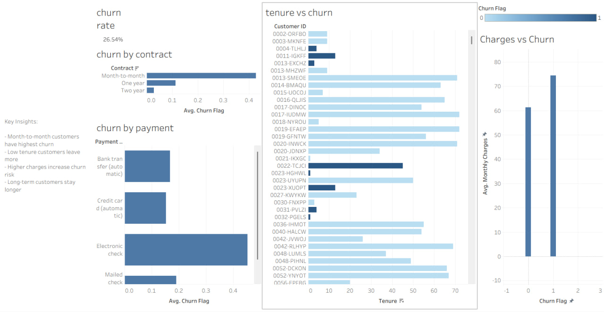

# 📊 Customer Churn & Retention Analysis Dashboard

## 📌 Project Overview
This project analyzes customer churn behavior using a telecom dataset. The goal is to identify patterns, understand retention drivers, and provide actionable business recommendations to reduce customer churn.

## 💼 Problem Statement
Telecom companies face significant revenue loss due to customer churn. Identifying the factors that lead to churn is essential for improving customer retention.

## 🎯 Objective
To analyze customer data and uncover key factors influencing churn, helping businesses take proactive retention measures.

## 📂 Dataset
**Telco Customer Churn Dataset**

## 🛠 Tools Used
- Python (Pandas, Matplotlib, Seaborn)  
- Tableau (Dashboard Visualization)  
- Jupyter Notebook  

## 🧹 Data Cleaning
- Checked and handled missing values  
- Converted categorical variables  
- Cleaned and formatted dataset for analysis  

## 📊 Exploratory Data Analysis (EDA)
Performed analysis on:
- Churn distribution  
- Customer tenure  
- Monthly charges  
- Contract types  
- Payment methods  

## 📸 Dashboard Preview

## 🔍 Key Insights
- Customers with month-to-month contracts have the highest churn rate  
- Customers with low tenure are more likely to churn  
- Higher monthly charges are associated with increased churn  
- Long-term contracts significantly improve retention  
- Payment methods influence churn behavior  

## 💡 Business Recommendations
- Offer discounts on long-term contracts to reduce churn  
- Improve onboarding experience for new customers  
- Target high-risk customers with personalized offers  
- Introduce loyalty programs to retain customers  
- Monitor customers with high monthly charges  

## 🧠 Skills Demonstrated
- Data Cleaning  
- Exploratory Data Analysis  
- Data Visualization  
- Customer Behavior Analysis  

## 🚀 Conclusion
This project highlights how data analysis can help businesses identify churn patterns and implement strategies to improve customer retention and customer lifetime value.
